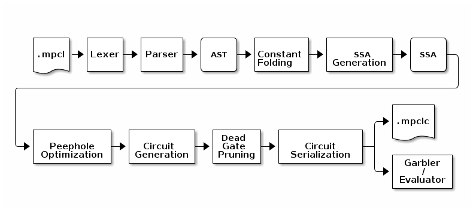
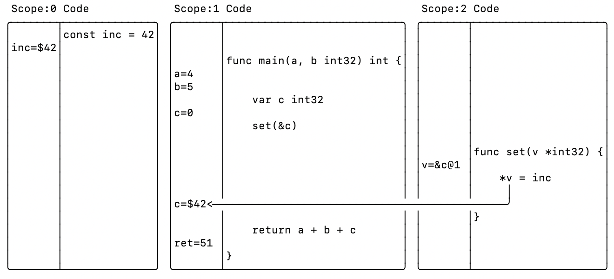
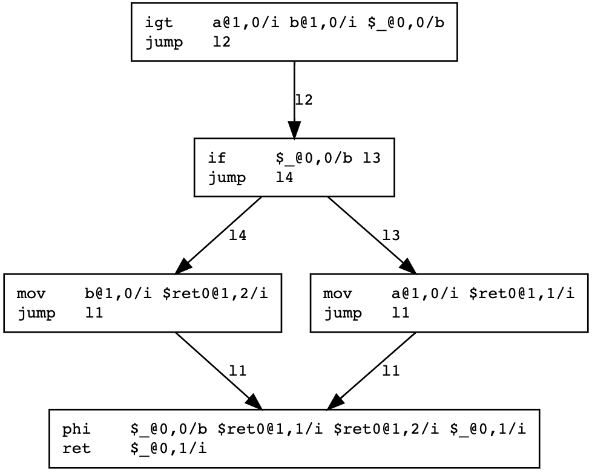
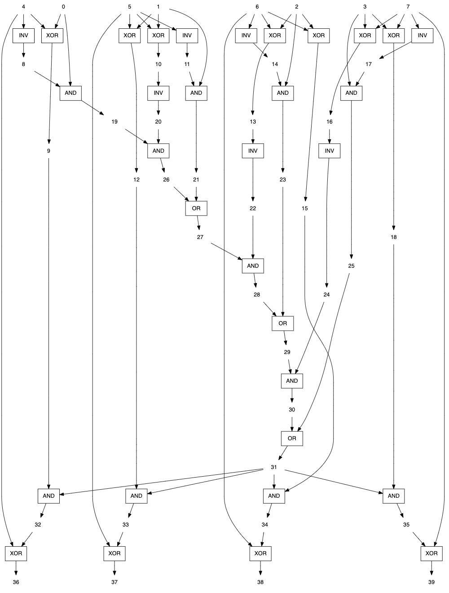

# mpc

Secure Multi-Party Computation with Go. This project implements secure
two-party computation with [Garbled circuit](https://en.wikipedia.org/wiki/Garbled_circuit) protocol. The main components are:
 - [garbled](apps/garbled/): **command-line program** for running MPCL programs
 - [compiler](compiler/): **Multi-Party Computation Language (MPCL)** compiler
 - [circuit](circuit/): **garbled circuit** parser, garbler, and evaluator
 - [ot](ot/): **oblivious transfer** library

## Getting started

The easiest way to experiment with the system is to compile the
[garbled](apps/garbled/) application and use it to evaluate MPCL
programs. The `garbled` application takes the following command line
options:

 - `-O`: optimization level (default 1 enabling all current optimizations).
 - `-circ`: compile inputs to circuit format.
 - `-cpuprofile`: write cpu profile to the specified file.
 - `-d`: enable diagnostics outputs.
 - `-dot`: generate Graphviz DOT output.
 - `-e`: specifies circuit _evaluator_ / _garbler_ mode. The circuit evaluator creates a TCP listener and waits for garblers to connect with computation.
 - `-format`: specifies circuit format for the `-circ` output file. Possible values are: `mpclc` (default), `bristol`.
 - `-i`: specifies comma-separated input values for the circuit.
 - `-memprofile`: write memory profile to the specified file.
 - `-ssa`: compile MPCL input to SSA assembly.
 - `-stream`: streaming mode.
 - `-v`: enabled verbose output.

The [examples](apps/garbled/examples/) directory contains various MPCL
example programs which can be executed with the `garbled`
application. For example, here's how you can run the [Yao's
Millionaires'
Problem](https://en.wikipedia.org/wiki/Yao%27s_Millionaires%27_Problem)
which can be found from the
[millionaire.mpcl](apps/garbled/examples/millionaire.mpcl) file:

```go
package main

func main(a, b int64) bool {
    if a > b {
        return true
    } else {
        return false
    }
}
```

First, start the evaluator (these examples are run in the
`apps/garbled` directory):

```
$ ./garbled -e -i 800000 examples/millionaire.mpcl
 - In1: a{1,0}i64:int64
 + In2: b{1,0}i64:int64
 - Out: %_{0,1}b1:bool1
 -  In: [800000]
Listening for connections at :8080
```

The evaluator's input is 800000 and it is set to the circuit inputs
`In2`. The evaluator is now waiting for garblers to connect to the TCP
port `:8080`.

Next, let's start the garbler:

```
$ ./garbled -i 750000 examples/millionaire.mpcl
 + In1: a{1,0}i64:int64
 - In2: b{1,0}i64:int64
 - Out: %_{0,1}b1:bool1
 -  In: [750000]
Result[0]: false
```

The garbler's input is 750000 and it is set to the circuit inputs
`In1`. The garbler connects to the evaluator's TCP port and they run
the garbled circuit protocol. At the end, garbler (and evaluator)
print the result of the circuit, which is this case is single `bool`
value `Result[0]`:

```
Result[0]: false
```

In our example, the evaluator's argument In2 is bound to the MPCL
program's `b int64` argument, and garbler's In1 to `a
int64`. Therefore, the result of the computation is `false` because
In1=750000 <= In2=800000. If we increase the garbler's input to 900000,
we see that the result is now `true` since the garbler's input is now
bigger than the evaluator's input:

```
$ ./garbled -i 900000 examples/millionaire.mpcl
 + In1: a{1,0}i64:int64
 - In2: b{1,0}i64:int64
 - Out: %_{0,1}b1:bool1
 -  In: [900000]
Result[0]: true
```

## Ed25519 Key Generation and Signature Computation

The [ed25519](apps/garbled/examples/ed25519/) directory contains
Ed25519 [key generation](apps/garbled/examples/ed25519/keygen.mpcl)
and [signature computation](apps/garbled/examples/ed25519/sign.mpcl)
examples.

### Key Generation

```
$ ./garbled -stream -e -v -i 0x784db0ec4ca0cf5338249e6a09139109366dca1fac2838e5f0e5a46f0e191bae,0xd0da45d3c99e756da831d1e7d696eae3fa9fe39d3b1b2618c7ff997d17777989b5cf415b114298c8b10bed0f0eff118e43ab606ab01143151dff89171307dffa,0x44bf09357e19b1f96f9cf6d9e7d25a0e8dd62d6e0d4bba2bec4c59983c7dc84d1486677b6d8837746cd948c881913c36faeaee08e8309afac58be4757a1c544e
```

```
$ ./garbled -stream -v -i 0x57c0e59c20ac7d75ef7e3188fdd7f5876abee1cab394af8125acaca9760bb54c,0x76b42e6292f4a3dc339d208481abeb9a24e08127c7cd8dbde62abcddc0c0e6f7a0f740e756b44dae137f0e7ff8eae0ceb1a962c130fdcbe8cbee3e31ab55b8dc,0xeb83eb1f5203f5b752c96264a21ff4a27fa60cf2313f5f53c3fa96e0b52a2814b786e43a3af64b66291b5b29f432cb8d5a930e31f4e6f072a6d33b861b5b5f13 examples/ed25519/keygen.mpcl
┏━━━━━━━━━━━━━┳━━━━━━━━━━━━━━━━━┳━━━━━━━━┳━━━━━━┓
┃ Op          ┃            Time ┃      % ┃ Xfer ┃
┡━━━━━━━━━━━━━╇━━━━━━━━━━━━━━━━━╇━━━━━━━━╇━━━━━━┩
│ Init        │      2.039289ms │  0.00% │   0B │
│ OT Init     │    248.443521ms │  0.27% │ 21kB │
│ Peer Inputs │   10.330183787s │ 11.10% │  1MB │
│ Eval        │ 1m22.462325965s │ 88.63% │ 14GB │
│ Total       │ 1m33.042992562s │        │ 14GB │
└─────────────┴─────────────────┴────────┴──────┘
Max permanent wires: 52138674, cached circuits: 23
#gates=824319227 (XOR=529672017 XNOR=28633983 AND=265892049 OR=116232 INV=4946 xor=558306000 !xor=266013227) #w=847060405
Result[0]: 8ae64963506002e267a59665e9a2e6f9348cc159be53747894478e182ece9fcb
Result[1]: 4ded80ae09692306c9659307f522f5dba1d96e48cde9f4f6e22fb340629db76aa2bee5867d009e008b6fb85902273acda8910c9a740a788f70c28ca0a3093835
Result[2]: cd5c37f4497fd56e236aa858442b3ff90f7a6401ee2186ea18d074fe93d8f9d18b582fa47a1ee0f0a9083ddd9e262b8f3c642dfad68f667f87dddd4bec80aca3
```

### Signature Computation

```
$ ./garbled -stream -e -v -i 0x46eb82a021d88960fb13388b0e76ba13b84524ffe114d7f3a728b39efc185eeaa7137132182bab7504daf200d882b787ee8b9b1c9f41be9c38fb4e0ba1aff326
```

```
$ ./garbled -stream -v -i 0x4d61726b6b7520526f737369203c6d747240696b692e66693e2068747470733a2f2f7777772e6d61726b6b75726f7373692e636f6d2f,0x5e768ad83640b43d93d6c26b34021d0a0cda6bf5eb962970554d7ab074e2f4cd49bc6fef2fa4dc2f763c1f70b751b7f03d398e8930d837130426454ea52d4449 examples/ed25519/sign.mpcl
┏━━━━━━━━━━━━━┳━━━━━━━━━━━━━━━━━┳━━━━━━━━┳━━━━━━━┓
┃ Op          ┃            Time ┃      % ┃  Xfer ┃
┡━━━━━━━━━━━━━╇━━━━━━━━━━━━━━━━━╇━━━━━━━━╇━━━━━━━┩
│ Init        │      1.303611ms │  0.00% │    0B │
│ OT Init     │    131.270606ms │  0.15% │  16kB │
│ Peer Inputs │    4.123998305s │  4.69% │ 667kB │
│ Eval        │ 1m23.745891208s │ 95.16% │  15GB │
│ Total       │  1m28.00246373s │        │  15GB │
└─────────────┴─────────────────┴────────┴───────┘
Max permanent wires: 53913890, cached circuits: 25
#gates=830082709 (XOR=533261481 XNOR=28815787 AND=267491441 OR=494216 INV=19784 xor=562077268 !xor=268005441) #w=853799279
Result[0]: b71a55aece64574bedd94729a9ca95a87b5fe0a587fecf50ff0238805132c1291e08cb871016cb4f3935bd45423626f61dc648a91affda3671b19d7b28e03505
```

# Multi-Party Computation Language (MPCL)

The multi-party computation language is heavily inspired by the Go
programming language, however it is not using the Go's compiler or any
other related components. The compiler is an independent
implementation of the relevant parts of the Go syntax.

## Compiler



The parser parses the MPCL input files, including any referenced
packages, and creates an abstract syntax tree (AST).

The AST is then converted into _Static Single Assignment_ form (SSA)
where each variable is defined and assigned only once. The SSA
transformation does also type checks so that all variable assignments
and function call arguments and return values are checked (or
converted) to be or correct type.



### Types

| Name    | Size          | Signed |
|:-------:|:-------------:|:------:|
| bool    | 1             | no     |
| uint    | unspecified   | no     |
| int     | unspecified   | yes    |
| uintN   | N             | no     |
| intN    | N             | yes    |
| floatN  | N             | yes    |
| stringN | N             | no     |

The unsized `uint` and `int` types can be used as function arguments
and return values. Their sizes are resolved during compilation
time. The only exception is the `main` function. Its arguments must
use fixed type sizes. The following example shows a `MinMax` function
that returns the minimum and maximum arguments. This function works
for all argument sizes.

```go
func MinMax(a, b int) (int, int) {
    if a < b {
        return a, b
    } else {
        return b, a
    }
}
```

### Builtin functions

The MPCL runtime defines the following builtin functions:

 - `copy(dst, src)`: copies the content of the array _src_ to
   _dst_. The function returns the number of elements copied, which is
   the minimum of len(src) and len(dst).
 - `len(value)`: returns the length of the value as integer:
   - array: returns the number of array elements
   - string: returns the number of bytes in the string
 - `make(type, size)`: creates an instance of the type _type_ with _size_ bits.
 - `native(name, arg...)`: calls a builtin function _name_ with
   arguments _arg..._. The _name_ can specify a circuit file (*.circ)
   or one of the following builtin functions:
   - `hamming(a, b uint)` computes the bitwise hamming distance between argument values
 - `size(variable)`: returns the bit size of the argument _variable_.

## SSA (Static single assignment form)

```go
package main

func main(a, b int4) int4 {
    if a > b {
        return a
    }
    return b
}
```

The compiler creates the following SSA form assembly:

```
# Input0: a{1,0}i4:int4
# Input1: b{1,0}i4:int4
# Output0: %_{0,1}i4:int4
# main#0:
	igt     a{1,0}i4 b{1,0}i4 %_{0,0}b1
	mov     a{1,0}i4 %ret0{1,1}i4
	mov     b{1,0}i4 %ret0{1,2}i4
# main.ret#0:
	phi     %_{0,0}b1 %ret0{1,1}i4 %ret0{1,2}i4 %_{0,1}i4
	gc      %_{0,0}b1
	gc      %ret0{1,1}i4
	gc      %ret0{1,2}i4
	gc      a{1,0}i4
	gc      b{1,0}i4
	ret     %_{0,1}i4
```


The SSA assembly (and logical circuit) form a Directed Acyclic Graph
(DAG) without any mutable storage locations. This means that all
alternative execution paths must be evaluate and when the program is
returning its computation results, any conflicting values from
different execution paths must be resolved with the branching
condition. This value resolution is implemented as the `phi` assembly
instruction, which effectively implements a MUX logical circuit:

    O=(D0 XOR D1)C XOR D0

| D0  | D1  | C   | D0 XOR D1 | AND C | XOR D0 |
|:---:|:---:|:---:|:---------:|:-----:|:------:|
| 0   | 0   | 0   |     0     |   0   |   0    |
| 0   | 1   | 0   |     1     |   0   |   0    |
| 1   | 0   | 0   |     1     |   0   |   1    |
| 1   | 1   | 0   |     0     |   0   |   1    |
| 0   | 0   | 1   |     0     |   0   |   0    |
| 0   | 1   | 1   |     1     |   1   |   1    |
| 1   | 0   | 1   |     1     |   1   |   0    |
| 1   | 1   | 1   |     0     |   0   |   1    |


## Circuit generation

The 3rd compiler phase converts SSA form assembly into logic gate
circuit. The following circuit was generated from the previous SSA
form assembly:



# TODO

 - [ ] Compiler
   - [ ] Incremental compiler
     - [ ] Constant folding
       - [ ] Implement arithmetics with `math.big` instead of int{32,64}
       - [ ] Implement using AST rewrite
       - [ ] binary expressions
       - [ ] if-blocks
       - [ ] For-loop unrolling
       - [ ] Function call and return
     - [ ] peephole optimization
       - [X] sort blocks in topological order
       - [X] peephole optimization over block boundaries
       - [ ] SSA aliasing is 1:1 but `amov` has 2:1 relation
       - [ ] variable liveness analysis for templates
     - [ ] BitShift
   - [ ] Circuit & garbling:
     - [ ] Oblivious transfer extensions
   - [ ] Misc:
     - [ ] Uninitialized variables produce unspecified values in stream mode
     - [ ] TLS for garbler-evaluator protocol
 - [ ] BMR multi-party protocol
 - [ ] Ed25519
   - [X] Parsing Ed25519 MPCL files
     - [ ] for-range statements
     - [ ] local variables in for-loop unrolling
   - [X] Pointer handling
     - [X] Pointer to struct field
     - [ ] Cleanup pointer r-value handling
     - [ ] Slices are passed by value instead of by reference
     - [ ] Selecting struct members from struct pointer value
   - [ ] Compound init values must be zero-padded to full size
   - [ ] Circuit generation:
     - [ ] SSA variable liveness analysis must be optimized
   - [ ] SHA-512 message digest
     - [ ] Empty arrays should be allowed, now unspecified length
     - [ ] `block = 0` sets block's type to int32
   - [ ] `copy()` does not work on arrays which have been `make()`:ed
   - [ ] `&base[pos][i]` returns the address of the first element
   - [ ] reading from `*[32]int32` returns invalid values

# Benchmarks and tests

Please, see the [benchmarks.md](benchmarks.md) file for information
about various benchmarks.

# Develoment ideas

## Mathematical operations

```go
package main

func main(a, b int) (int, int) {
    q, r := a / b
    return q, r
}
```
